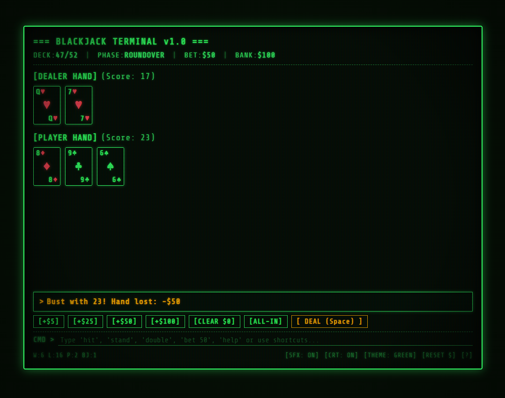

# TUI Blackjack Terminal (Web-Based, 4:3 Aspect Ratio)

A retro terminal / TUI (Text User Interface) Blackjack game designed to run natively in any modern web browser with a strict **4:3 aspect ratio** and authentic CRT phosphor green aesthetics.

Inspired by classic mainframe and VT100/DOS terminal blackjack games.



## Features

- **Strict 4:3 Aspect Ratio CRT Display**: Dynamically scales to fit any screen while perfectly preserving the vintage 4:3 proportion.
- **Authentic Retro CRT Visuals**:
  - Phosphor green glow (`#33ff66`), scanlines, refresh bar, and subtle curvature vignette.
  - Multi-theme support: **Green Phosphor**, **Amber CRT**, **Cyan Matrix**, and **Classic Mono**.
  - CRT effects toggle (`[CRT: ON/OFF]`).
- **ANSI Card Rendering**:
  - Boxed ASCII playing cards with crisp terminal borders.
  - Distinct red highlighting for Hearts and Diamonds (`♥`, `♦`).
  - Face-down hole card rendered with authentic ASCII pattern:
    ```
    +---+
    | # |
    | # |
    ```
- **Dual Control Mode**:
  - **TUI Action Buttons**: Clickable retro bracketed buttons (`[ H: HIT ]`, `[ S: STAND ]`, etc.).
  - **Keyboard Shortcuts**: Single-key actions for lightning-fast gameplay.
  - **Command Prompt (`CMD >`)**: Type natural commands like `hit`, `stand`, `bet 50`, `deal`, `double`, `split`, `allin`.
- **Synthesized 8-Bit Audio**:
  - Pure Web Audio API sound synthesis (zero audio files needed).
  - Mechanical key clicks, card deal sounds, chip clinks, win arpeggios, and bust buzzers.
  - Persistent SFX mute toggle.
- **Casino Blackjack Rules**:
  - Single/Multi-deck shoe with running deck counter (`DECK: 52/52`).
  - Natural 21 Blackjack pays 3:2.
  - Double Down, Split pairs, and Surrender supported.
  - Dealer draws to 16, stands on 17.
  - Persistent bankroll and win/loss/push statistics.

---

## Quick Start

### Option 1: Using Python (Instant)
```bash
python -m http.server 3000
```
Open [http://localhost:3000](http://localhost:3000) in your browser.

### Option 2: Using Node.js
```bash
npm start
```
or
```bash
npx serve . -l 3000
```

---

## Keyboard Controls

| Key | Action |
|---|---|
| `Space` or `Enter` | Deal Hand / Next Round |
| `H` | Hit (draw a card) |
| `S` | Stand (end turn) |
| `D` | Double Down |
| `P` | Split (when dealt a pair) |
| `R` or `U` | Surrender (recover half bet) |
| `1` | Add $5 to Bet |
| `2` | Add $25 to Bet |
| `3` | Add $50 to Bet |
| `C` | Reset Bet to minimum ($5) |
| `A` | All-In Bet |
| `T` | Cycle Theme (Green / Amber / Cyan / Classic) |
| `O` | Toggle CRT Scanline Effects |
| `M` | Toggle SFX Mute |
| `?` | Open Command Manual / Help Modal |

---

## Terminal Commands (`CMD >`)

You can type the following commands into the terminal prompt:
- `deal` / `d`
- `hit` / `h`
- `stand` / `s`
- `double` / `dd`
- `split` / `sp`
- `surrender` / `sur`
- `bet 25` (set bet to $25)
- `allin`
- `clear` / `min`
- `reset` (resets bankroll to $1000)
- `theme amber` (or `green`, `cyan`, `classic`)
- `crt` (toggle scanlines)
- `sfx` (toggle audio)
- `help` / `?`
