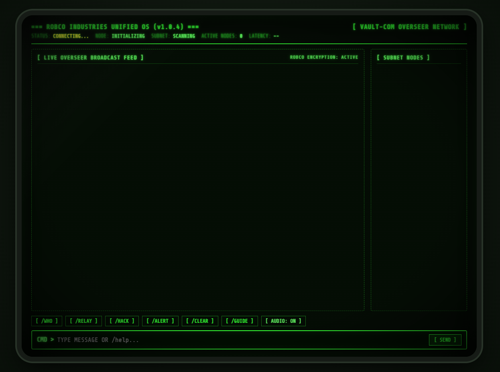

# === VAULT-COM // ROBCO OVERSEER TERMINAL ===

```
   ██████╗  ██████╗ ██████╗  ██████╗ ██████╗ 
   ██╔══██╗██╔═══██╗██╔══██╗██╔════╝██╔═══██╗
   ██████╔╝██║   ██║██████╔╝██║     ██║   ██║
   ██╔══██╗██║   ██║██╔══██╗██║     ██║   ██║
   ██║  ██║╚██████╔╝██████╔╝╚██████╗╚██████╔╝
   ╚═╝  ╚═╝ ╚═════╝ ╚═════╝  ╚═════╝ ╚═════╝ 
   === UNIFIED OPERATING SYSTEM (v1.0.4) ===
```

> **A fun, retro-futuristic weekend project** inspired by the classic **Fallout RobCo Overseer terminal network**.  
> An air-gapped, zero-cloud LAN web Terminal User Interface (TUI) that lets any phone, laptop, or desktop on the same Wi-Fi communicate in real time through an authentic green phosphor CRT monitor.


---

## Highlights & Features

- 🟢 **Authentic 4:3 CRT Shader:** Monochromatic green phosphor palette (`#33ff33` on `#050d05`), curved glass monitor bezel, scanline raster overlay, subtle 60Hz micro-flicker, and phosphor text bloom.
- 🔊 **100% Procedural Web Audio Synthesis:** Zero audio files or external sound assets needed. All mechanical switch clicks, FSK teletype chirps, 60Hz transformer power-on hum, 15.7kHz flyback whistle, and red alert klaxon alarms are synthesized in real time using the native Web Audio API.
- 🛡️ **Zero-Cloud & Air-Gapped (LAN Only):** Connects strictly across your local Wi-Fi or Ethernet subnet. No accounts, no database, no trackers, and no external internet dependencies.
- 🧹 **Ephemeral In-Memory Ring Buffer:** Stores only the last 100 transmissions in host memory. When the host powers down, all message history is permanently wiped.
- 📱 **Mobile & Tablet Optimized:** Responsive touch-friendly layout with horizontal swipeable bracket buttons, virtual keyboard viewport handling (`interactive-widget=resizes-content`), single-thumb `[ SEND ]` button, and mobile haptic vibration feedback (`navigator.vibrate`).
- 📻 **Zero-Config LAN Discovery:** Automatic mDNS broadcast allows devices on your Wi-Fi to join via `http://vaultcom.local:8080` without typing raw IP addresses.
- 🧩 **Built-in RobCo Hacking Minigame (`/hack`):** Authentic replica of the Fallout terminal password decryption puzzle, featuring hex memory dumps, word likeness scores, and the secret **bracket-matching mechanic** (`(...)`, `[...]`, `{...}`, `<...>`) that removes duds and replenishes your attempt allowance.
- 🚨 **Subnet-Wide Red Alert (`/broadcast-red`):** Shifts all connected monitors to flashing red phosphor with emergency alarm sirens.

---

## Architecture

```
                       [ Local Wi-Fi / LAN Subnet ]
                                    │
          ┌─────────────────────────┼─────────────────────────┐
          │                         │                         │
┌───────────────────┐     ┌───────────────────┐     ┌───────────────────┐
│  Overseer Node A  │     │  Dweller Node B   │     │  Security Node C  │
│  (Desktop / CRT)  │     │  (Phone / Mobile) │     │  (Laptop / CRT)   │
└─────────┬─────────┘     └─────────┬─────────┘     └─────────┬─────────┘
          │                         │                         │
          └────────────┬────────────┴────────────┬────────────┘
                       │ Native WebSocket        │
                       ▼                         ▼
       ┌──────────────────────────────────────────────────────┐
       │            VAULT-COM Host Daemon (Node.js)           │
       │  - Zero-Build Static Asset Server                    │
       │  - Native WebSocket Broadcast Engine (`ws`)          │
       │  - mDNS Beacon (`bonjour-service` -> vaultcom.local) │
       │  - Subnet IP Auto-Detection & Role Assignment        │
       │  - Ephemeral 100-Message Ring Buffer                 │
       │  - Slash Command Router (/who, /relay, /hack)        │
       └──────────────────────────────────────────────────────┘
```

---

## Quick Start

### 1. Prerequisites
- **Node.js** (v18 or higher recommended)
- **npm**

### 2. Installation
Clone or download this repository, then install dependencies:
```bash
git clone https://github.com/your-username/vault-com.git
cd vault-com
npm install
```

### 3. Launch the Terminal Network
```bash
npm start
```

You will see the RobCo startup banner:
```
=====================================================
   ROBCO INDUSTRIES UNIFIED OPERATING SYSTEM v1.0
   VAULT-COM LOCAL NETWORK OVERSEER TERMINAL
=====================================================
 Subnet IP: http://192.168.1.15:8080
 Localhost: http://localhost:8080
 mDNS URL:  http://vaultcom.local:8080
 Subnet:    192.168.1.0/24
 Bound to:  0.0.0.0:8080 (LAN Only)
=====================================================
```

### 4. Connect Devices
- **On this machine:** Open `http://localhost:8080` in any web browser.
- **From your smartphone or laptop:** Connect to the same Wi-Fi and open `http://vaultcom.local:8080` (or `http://<YOUR-PC-IP>:8080`).

---

## Command Index

Type any message in the `CMD >` prompt and press **Enter** to broadcast to all nodes on the subnet, or use slash commands:

| Command | Action |
| :--- | :--- |
| `<MESSAGE> (Enter)` | Broadcast open transmission to all active Vault terminals |
| `/who` or `[ /WHO ]` | Query and print all active Vault terminals on the subnet |
| `/relay <node-id> <msg>` | Send an encrypted direct point-to-point transmission |
| `/clear` or `[ /CLEAR ]` | Wipe local terminal display history buffer |
| `/broadcast-red [reason]` | Trigger emergency red alert pulse with audible klaxon alarms |
| `/broadcast-clear` | Cancel emergency red alert and restore normal green phosphor |
| `/hack` or `[ /HACK ]` | Launch the RobCo Termlink password decryption minigame |
| `/handle <name>` | Request a new callsign (e.g. `/handle TECH-99`) |
| `/guide` or `[ /GUIDE ]` | Open the built-in Vault-Tec Overseer Field Manual |
| `/sound` or `[ AUDIO ]` | Toggle procedural mechanical key clicks and teletype chirps |
| `/help` | Print the quick in-terminal command list |

---

## The RobCo Hacking Minigame Guide

Launch the puzzle at any time by typing `/hack` or clicking **`[ /HACK ]`**.

```
0xF210  !@#$BUNKER%^&*    0xF270  TURRET!@()#$
0xF21C  ()<>[]{}MUTANT    0xF27C  RADIUS<>[];;
0xF228  !@#$SILVER%^&*    0xF288  !@#$%^ATOMIC
```

1. **Password Likeness:** When you click a candidate word, the terminal reveals its *Likeness* score (the count of letters matching the secret target password in the exact same position).
2. **The Secret Bracket-Matching Mechanic:**  
   Scan the random punctuation on each row for matching bracket pairs: `(...)`, `[...]`, `{...}`, or `<...>`. Clicking any valid bracket pair will:
   - **REMOVE A DUD:** Replaces an incorrect candidate word with dots (`......`).
   - **REPLENISH TRIES:** Resets your attempts remaining back to `4/4`!
3. **Overseer Status:** Cracking the password broadcasts an administrator override announcement across the entire local network!

---

## Repository Structure

```
vault-com/
├── .gitignore                # Ignores node_modules, logs, and system files
├── LICENSE                   # MIT License
├── package.json              # Server dependencies & scripts
├── README.md                 # Project documentation & guide
├── server.js                 # HTTP + WebSocket + mDNS LAN daemon
├── tests/
│   ├── test-ws.js            # Automated protocol verification test suite
│   └── test-multinode.js     # Multi-device broadcast & relay test
└── public/
    ├── index.html            # CRT monitor layout, bezels, & overlays
    ├── css/
    │   ├── crt.css           # 4:3 aspect ratio, scanlines, bloom, flicker
    │   └── terminal.css      # Typography, action bar, mobile styles, guide
    └── js/
        ├── audio.js          # Procedural Web Audio API synthesizer
        ├── protocol.js       # WebSocket manager, ping/pong, auto-reconnect
        ├── hack.js           # Fallout RobCo bracket-matching hacking puzzle
        └── app.js            # TUI state machine & slash command interpreter
```

---

## Testing

Run the included verification test suite:
```bash
npm test
```
